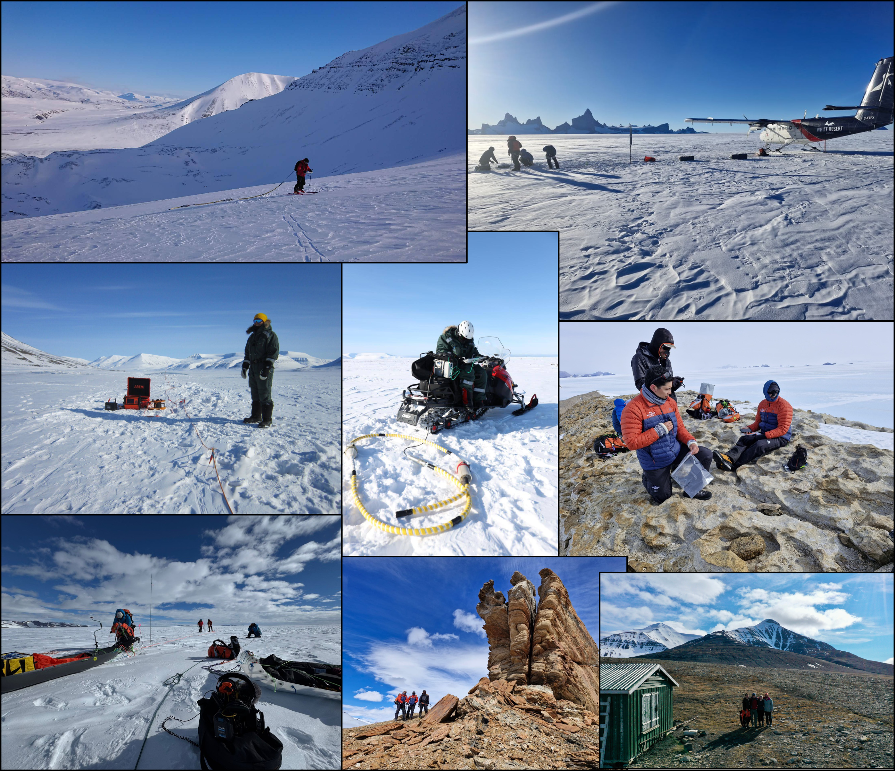

## Hello!

I'm a geophysicist interested in the subsurface exploration of glaciers and exoplanetary bodies. This includes various aspects of computational geophysics, including forward modelling, inversion, and the implementation of ML/AI algorithms.

I'm presently a postdoctoral researcher at the University of Tasmania, Australia.

Feel free to reach out to me via email or LinkedIn if you want to chat or collaborate: [ian.kelly@utas.edu.au](ian.kelly@utas.edu.au) or [https://www.linkedin.com/in/iandalekelly/](https://www.linkedin.com/in/iandalekelly/).

### Current work

- Developing a geospatial database and map summarizing present knowledge of groundwater in Antarctica ([repository link](https://github.com/iandalekelly/SCAR_Groundwater_Treasure_Map)).
- Developing an inversion framework for HVSRs using peak and trough frequencies ([repository link](https://github.com/iandalekelly/HVSRs-PeakAndTroughFreqs)).
- Creating a continental map of Antarctic crustal structure from single-station passive seismic methods.

### Also see

- The "cryoquake" tool set for detecting, characterizing, and locating cryoseismic events developed by my PhD colleague Jared Magyar ([repository link](https://github.com/JMagyar15/cryoquake)), as used in [Maygar et al. (2026)](https://doi.org/10.1017/jog.2026.10153) ([repository link](https://github.com/JMagyar15/sorsdal-analysis)).
- Work by my PhD supervisor Tobias Staal ([GitHub profile](https://github.com/TobbeTripitaka)), including the "agrid" package for modelling, visualizing, and analyzing multi-dimensional geospatial data sets ([repository link](https://github.com/TobbeTripitaka/agrid)), and the "Aq"/"Kq2" geothermal heat flow models for Antarctica and Greenland ([Aq1 repository link](https://github.com/TobbeTripitaka/Aq1), [Aq2/Kq2 repository link](https://github.com/TobbeTripitaka/Aq2)).

And here's some fieldwork photos from the Arctic and Antarctica:

